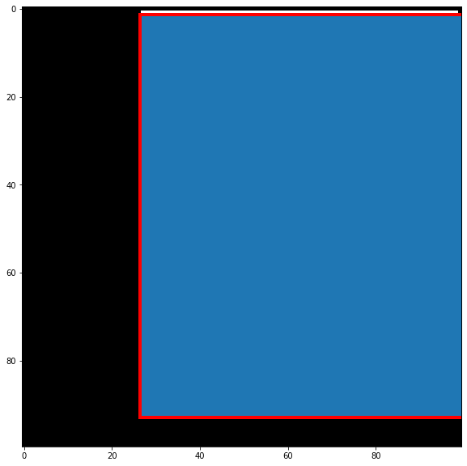
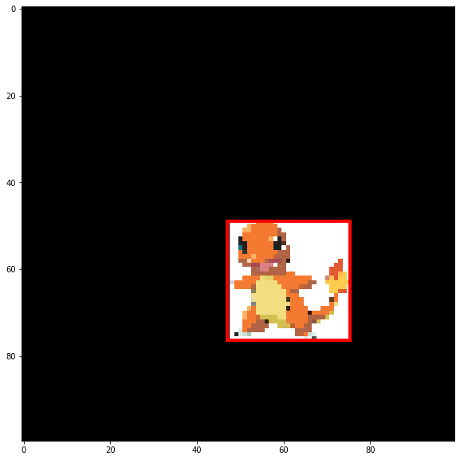
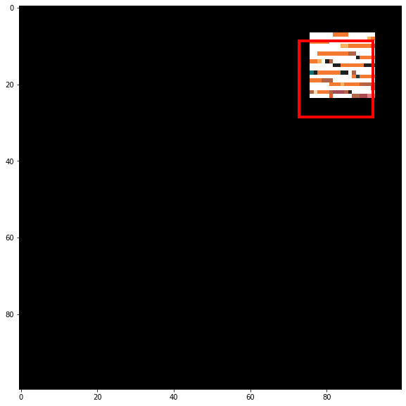
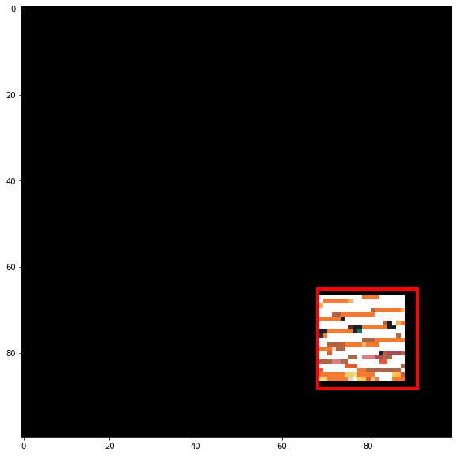
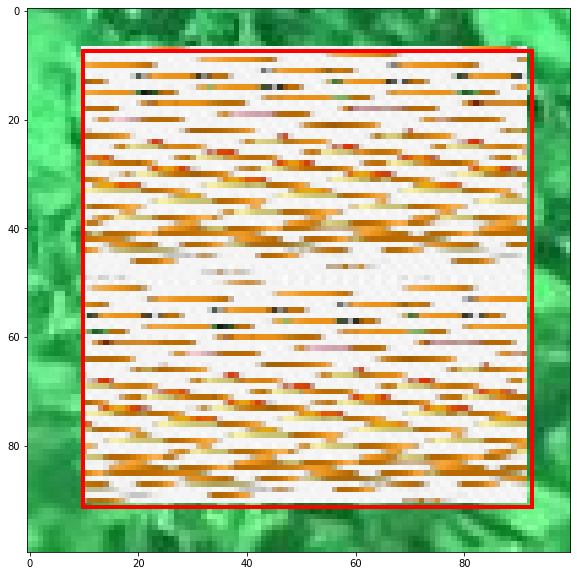
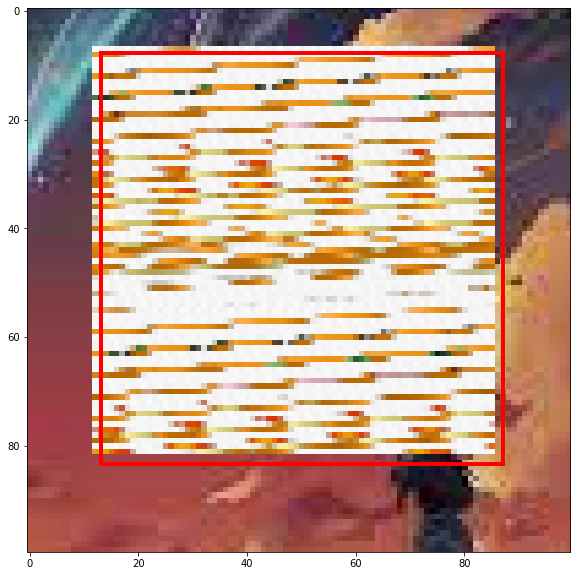

# Object Localization

This Repository shows my attempt to make my own Deep Learning for Object Localization and tracking. I added to noise to the object to see whether the model will able to find it as a step higher to the model.

## Introduction

Object Localization Models are AI Models that two tasks which are classification and find where the object is located. in my own implementation i added noise to the object to see whether the model will do a mistake or not.
I used a square first then a pokemon to make it more fun.

## Dataset

there was no dataset, however you could use any picutre dataset for this project.

The data i used was randomly generated expect for the pokemon picture which i got it off google.

## Methodology

I used vgg16 model excluding its head since i will only use it for feature extraction then add two layers on top the vgg16 model, which are the flatten layer and a dense layer with 4 neurons in the latter. the 5 neurons contribute to classification, x0, y0, height and width. if the model didn't classify anything, the others will be 0 since we don't have any object to find. I used a custom error function which calculate the error of the classification alone using binary cross entropy function as the value is merged between 1 and 0, then with the other one's i used the same function for their calculation alone, lastly i multiply the classification error with 0.5 as weight and the other one with 2 as weight to emphasize on the error of finding the object and multiply it with true value of classification since if it's not there the error will be on the classification objective only

## Experiments

1. The first experiment was only to find the object that is randomly genereated with blank background and assume it's always there.
   - epochs: `20`
   - step per epochs: `50`
   - loss: `0.5347`
   - accuracy: `0.9762`

2. The second experiment was only to find the object that was a pokemon with blank background and assume it's always there.
   - epochs: `20`
   - step per epochs: `50`
   - loss: `0.5678`
   - accuracy: `0.9106`
  
3. The third experiment was only to find the object that was a pokemon with some noise added to it with blank background and assume it's always there.
   - epochs: `20`
   - step per epochs: `50`
   - loss: `0.5623`
   - accuracy: `0.8694`

4. The fourth experiment was only to find the object that was a pokemon with some noise added to it but flipped with blank background and assume it's always there.
   - epochs: `20`
   - step per epochs: `50`
   - loss: `0.5562`
   - accuracy: `0.8794`
  
5. The fifth experiment was only to find the object that was a pokemon with some noise added to it but flipped with background and assume it's always there.
   - epochs: `20`
   - step per epochs: `50`
   - loss: `0.5205`
   - accuracy: `0.9875`

6. The six experiment was only to find the object that was a pokemon with some noise added to it but flipped with background and find if whether the object was there or not.
   - epochs: `20`
   - step per epochs: `50`
   - loss: `0.5095`
   - accuracy: `0.4938`

## Results

- first experiment result:
  

- second experiment result:
  
  
- third experiment result:
  
  
- fourth experiment result:
  
    
- fifth experiment result:
  
      
- six experiment result:
  

## Contribution

Contributions are welcome! If you have any improvements or new features you would like to add, please submit a pull request.
   

